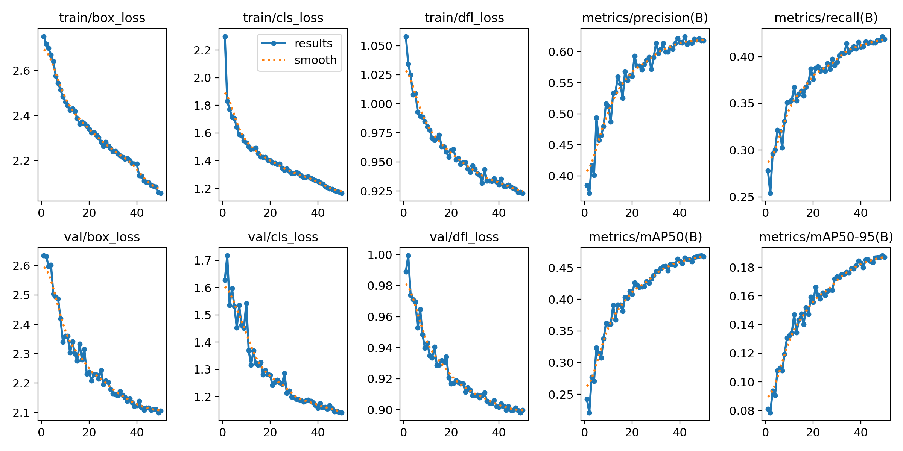
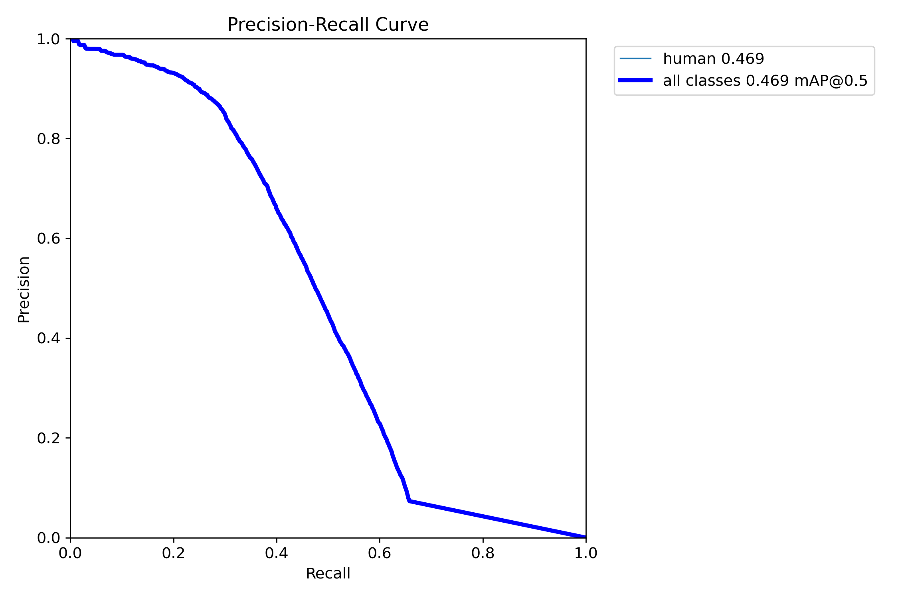
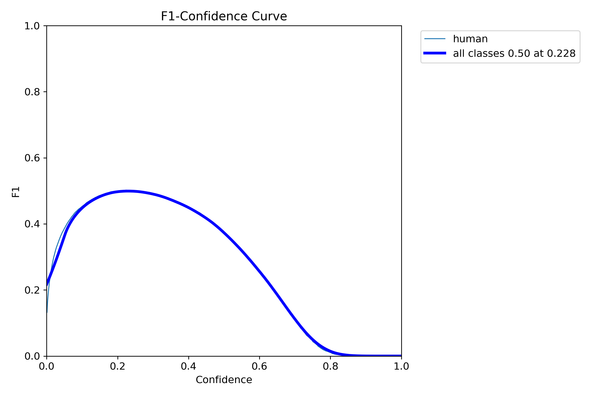
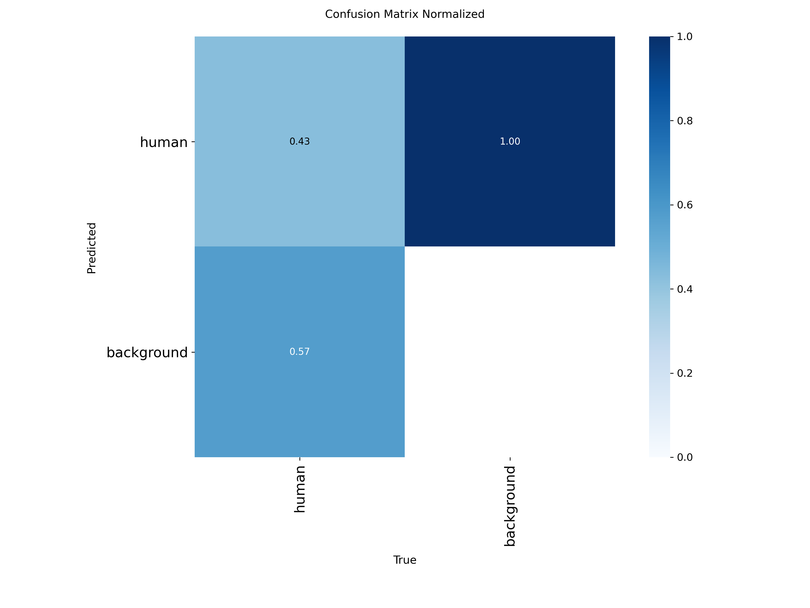
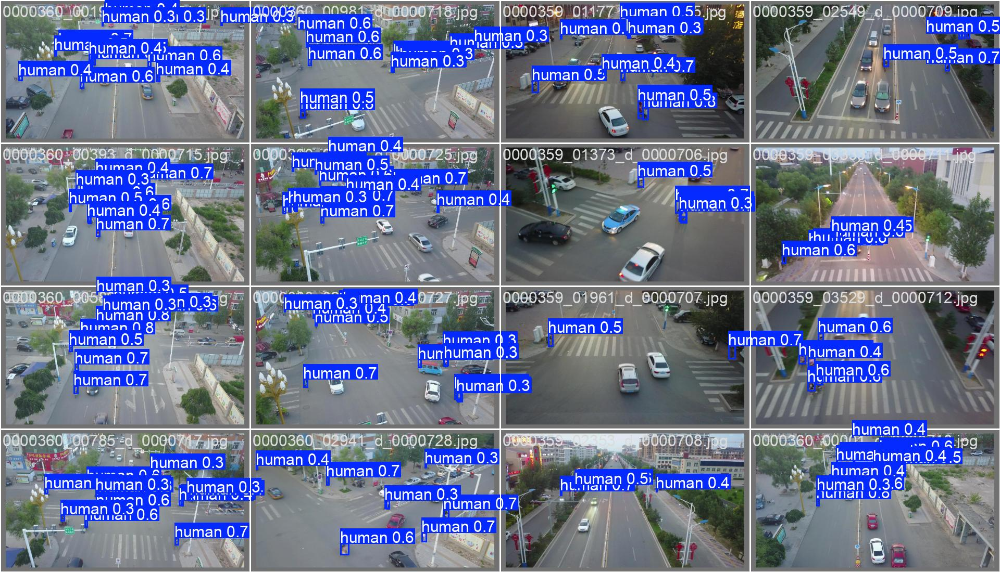

# Deep Learning-Based Human Detection from UAV Images 🚁

> 🚧 **Work In Progress** — This project is still under active development. Accuracy improvements are ongoing.

A computer vision project that fine-tunes a **YOLOv8** object detection model to detect humans (pedestrians and people) in aerial images captured by drones (UAVs), using the **VisDrone 2019** benchmark dataset.

---

## 📋 Table of Contents

- [Overview](#overview)
- [Dataset](#dataset)
- [Data Preprocessing](#data-preprocessing)
- [Model & Training](#model--training)
- [Current Results](#current-results)
- [Result Visualizations](#result-visualizations)
- [Planned Improvements](#planned-improvements)
- [Getting Started](#getting-started)

---

## Overview

Detecting humans from drone footage is a challenging task due to:
- **Small object sizes** — people appear very small from high altitude
- **Dense crowds** — many individuals clustered together
- **Varied backgrounds** — roads, rooftops, parks, etc.

This project trains a lightweight **YOLOv8n** (nano) model purely on the human classes from VisDrone, mapping them into a single unified class: **Human**.

---

## Dataset

**[VisDrone 2019](https://github.com/VisDrone/VisDrone-Dataset)** — a large-scale benchmark for drone-based vision tasks.

| Split | Images | (Filtered — humans only) |
|---|---|---|
| Train | 6,471 | ~5,684 |
| Val | 548 | ~531 |

**VisDrone classes used:**
- Class 1: Pedestrian → merged into `0: Human`
- Class 2: People → merged into `0: Human`

All other classes (cars, trucks, buses, bicycles, etc.) are discarded.

> ⚠️ The raw dataset is not included in this repo due to its large size. Download it from the [VisDrone official page](https://github.com/VisDrone/VisDrone-Dataset).

---

## Data Preprocessing

The script `convert_visdrone_to_yolo.py` converts VisDrone annotations to YOLO format:

| VisDrone Format | YOLO Format |
|---|---|
| `x_min, y_min, width, height` (pixels) | `x_center, y_center, width, height` (normalized 0–1) |

**Usage:**
```bash
python convert_visdrone_to_yolo.py
```

This will:
1. Read images and annotation `.txt` files from `VisDrone2019-DET-train/` and `VisDrone2019-DET-val/`
2. Filter only human detections (classes 1 & 2)
3. Convert coordinates to YOLO format
4. Output to `datasets/visdrone_human/train/` and `datasets/visdrone_human/val/`

---

## Model & Training

| Parameter | Value |
|---|---|
| Base model | `yolov8n.pt` (pretrained on COCO) |
| Task | Object Detection |
| Epochs | 50 |
| Batch size | 16 |
| Image size | 640 × 640 |
| Optimizer | Auto (SGD) |
| IoU threshold | 0.7 |
| Platform | Google Colab |

Training was run on Google Colab with a GPU. The `args.yaml` in `results/` contains the full configuration.

---

## Current Results

> ⚠️ These are preliminary results — the model is still being improved.

| Metric | Epoch 1 | Epoch 50 |
|---|---|---|
| mAP@50 | 0.242 | **0.467** |
| mAP@50-95 | 0.081 | **0.187** |
| Precision | 0.384 | **0.618** |
| Recall | 0.278 | **0.419** |
| Train Box Loss | 2.752 | 2.054 |

The model shows consistent improvement across all 50 epochs, with no signs of overfitting.

---

## Result Visualizations

**Training Metrics:**



**Precision-Recall Curve:**



**F1 Score Curve:**



**Confusion Matrix:**



**Validation Predictions (sample):**



---

## Planned Improvements

- [ ] Use a larger YOLOv8 variant (`yolov8s`, `yolov8m`) for better accuracy
- [ ] Train for more epochs (100+)
- [ ] Include background images (no-human frames) to reduce false positives
- [ ] Apply stronger data augmentation (mosaic, mixup)
- [ ] Experiment with multi-scale training
- [ ] Evaluate on the VisDrone test set

---

## Getting Started

### Requirements

```bash
pip install ultralytics opencv-python tqdm
```

### 1. Download the Dataset

Download **VisDrone2019-DET-train** and **VisDrone2019-DET-val** from the [official VisDrone repo](https://github.com/VisDrone/VisDrone-Dataset) and place them in the project root.

### 2. Convert Annotations

```bash
python convert_visdrone_to_yolo.py
```

### 3. Train

Create a `data.yaml` file:

```yaml
path: ./datasets/visdrone_human
train: train/images
val: val/images
nc: 1
names: ['Human']
```

Then train:

```python
from ultralytics import YOLO

model = YOLO('yolov8n.pt')
model.train(data='data.yaml', epochs=50, imgsz=640, batch=16)
```

---

## License

This project uses the [VisDrone Dataset](https://github.com/VisDrone/VisDrone-Dataset) which is for non-commercial research use. Please refer to the original dataset license for details.
